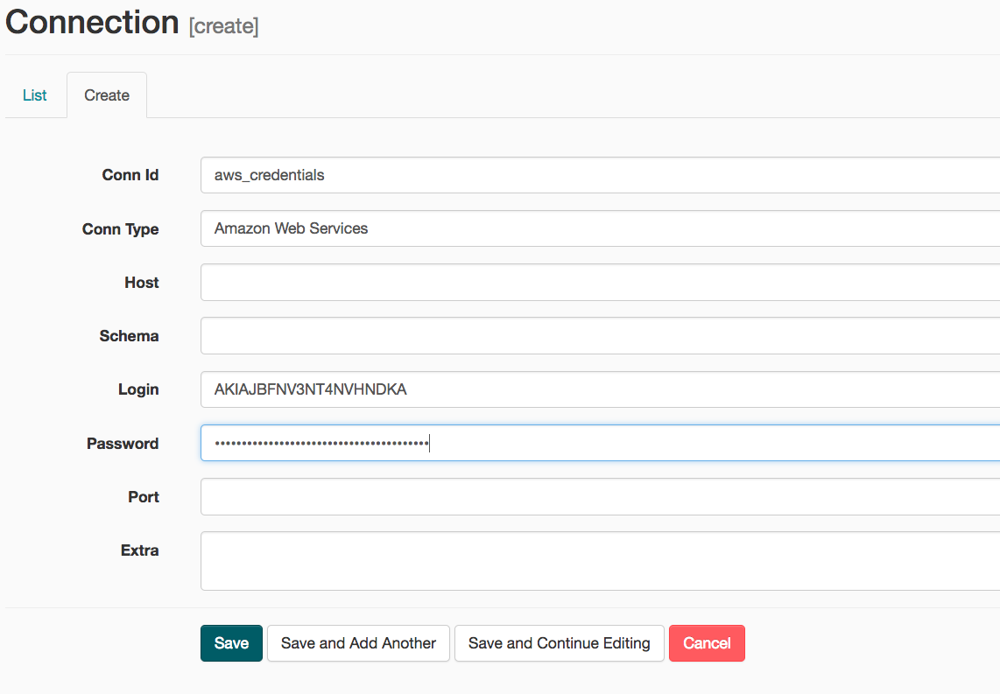

# Data Pipelines with Apache Airflow

A music streaming startup, Sparkify, has grown their user base and song database and want to move their processes and data onto the cloud. Their data resides in S3, in a directory of JSON logs on user activity on the app, as well as a directory with JSON metadata on the songs in their app.

This codebase creates a database containing 5 tables in star schema,
that organizes data related to this music library, and user listening data. This data
has been extracted from these two next sources: 

- Song data: `s3://udacity-dend/song_data`

Sample: 
```
{
    "num_songs": 1, 
    "artist_id": "ARJIE2Y1187B994AB7", 
    "artist_latitude": null, 
    "artist_longitude": null, 
    "artist_location": "", 
    "artist_name": "Line Renaud",
    "song_id": "SOUPIRU12A6D4FA1E1", 
    "title": "Der Kleine Dompfaff", 
    "duration": 152.92036, 
    "year": 0
 }
```
- Log data: `s3://udacity-dend/log_data`

Sample: 


Using Apache Airflow, a pipeline is executed, which first stages these datasets
in Amazon Redshift. Then the data is extracted an introduced into 5 different 
tables in star-schema: 

- **Songplay Table**: this represents the only fact table in the star schema. It contains 
  data related to how users listen to music, including the time at which they listen to it, 
  their location, what song and artist (related with their IDs) the event relates to, and other
  pieces of information that can be used to analyze user listening activity. 

- **Users Table**: a dimension table, that holds user's data, including their first and last name,
  their gender and whether or not they're subscribed. 

- **Songs Table**: a dimension table, that holds songs details, including the title, it's 
  contributing artist, the duration, the year of its release, etc. 

- **Artist Table**: a dimension table, that holds aritst details, including their name and 
  their location. 

- **Time Table**: a dimension table, that holds many different ways of interpreting a timestamp, 
  like a weekday, hour, month, day of month, etc. 

## Brief explanation of each file in this repository

- `dags/udac-example-dag.py` : contains the DAG (Directed Acyclic Graph). The 
    steps for the execution of the pipeline are defined here, and also the order
    in which these steps must be executed. The steps are shown in the next image: 
    

- `plugins/operators/data_quality.py`: DAG operator for data quality check. 
- `plugins/operators/load_dimension.py`: DAG operator for loading a dimension 
    table given an SQL query. 
- `plugins/operators/load_fact.py`: DAG operator for loading a fact table, given
    an SQL query. 
- `plugins/operators/stage_redshift.py`: DAG operator for extracting data from
    S3 and staging in Redshift. 
- `plugins/helpers/sql_queries.py`: Class containing SQL queries for pushing data
    into fact and dimension tables for Sparkify. 
- `create_tables.sql`: Queries for creating tables mentioned above. 

## Running this project

After launching Airflow with the folder structure of this repo, add the 
connections for AWS and Redshift. 

- AWS:
    - Conn Id: Enter aws_credentials.
    - Conn Type: Enter Amazon Web Services.
    - Login: Enter your Access key ID from the IAM User credentials 
    - Password: Enter your Secret access key from the IAM User credentials
    

- Redshift: 
    - Conn Id: Enter redshift.
    - Conn Type: Enter Postgres.
    - Host: Enter the endpoint of your Redshift cluster, excluding the port at the end. You can find this by selecting your cluster in the Clusters page of the Amazon Redshift console. IMPORTANT: Make sure to NOT include the port at the end of the Redshift endpoint string.
    - Schema: Enter dev. This is the Redshift database you want to connect to.
    - Login: Enter awsuser.
    - Password: Enter the password you created when launching your Redshift cluster.
    - Port: Enter 5439.
    
